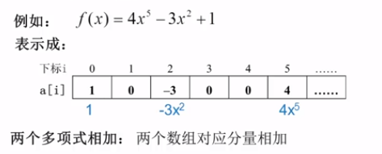
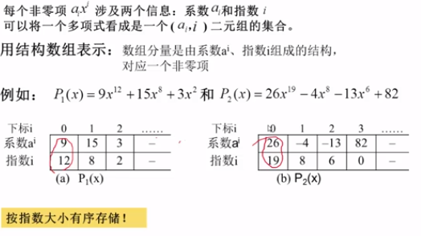
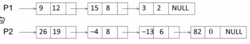
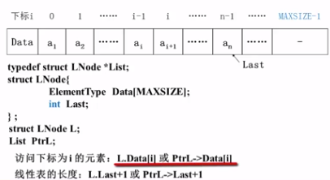
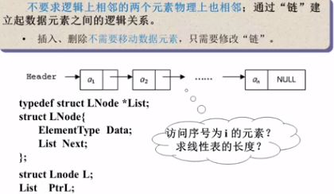
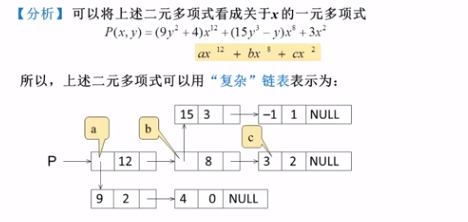
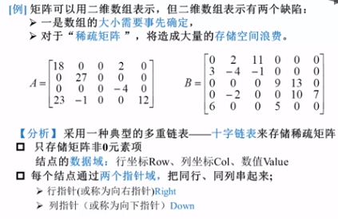
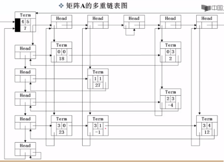
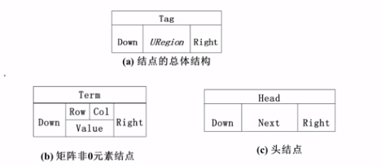

# 数组模拟(静态链表)

- 使用数组模拟可以提高效率，指针+结构体的实现方式每次创建一个新链表时都要`new Node();`，此操作很慢，容易超时，所以处于效率考虑，写笔试题一般不采用这种动态链表的方式。可以通过直接初始化n个Node进行改进，但是那种方式本质就和数组模拟(静态链表)差不多。
<!--more-->
### 单链表 & 邻接表

- 单链表最主要用途是写邻接表，邻接表其实是n个链表，最主要的应用是存储图和树，比如最短路问题，最小生成树，最大流问题都是邻接表存储。

- 结构：head -> # -> # -> # -> 0

- 需要定义：value - `e[N]`, *next -> `ne[N]`,  通过下标进行关联

```cpp
  #include <iostream>
  using namespace std;
  
  const int N = 100010;
  // head 表示头节点下标
  // e[i] 表示节点i的值
  // ne[i] 表示节点i的next指针是多少
  // idx 存储当前已经用到了哪个点
  int head, e[N], ne[N], idx;
  
  // 初始化
  void init()
  {
      head = -1;
      idx = 0;
  }
  
  // 将x插到头节点
  void add_to_head(int x)
  {
      e[idx] = x;
      // idx指向head原本指向的值
      ne[idx] = head;
      // head指向idx
      head = idx;
      // idx节点已被使用
      idx++;
  }
  
  // 将x插入到下标为k的点后面
  void add(int k, int x)
  {
      e[idx] = x;
      ne[idx] = ne[k];
      ne[k] = idx;
      idx++;
  }
  
  // 将下标为k的点后面的点删掉
  void remove(int k)
  {
      ne[k] = ne[ne[k]];
  }
```
- AcWing 826：实现一个单链表，链表初始为空，支持三种操作：

  (1) 向链表头插入一个数；

  (2) 删除第k个插入的数后面的数；

  (3) 在第k个插入的数后插入一个数

  现在要对该链表进行M次操作，进行完所有操作后，从头到尾输出整个链表。

  **注意**:题目中第k个插入的数并不是指当前链表的第k个数。例如操作过程中一共插入了n个数，则按照插入的时间顺序，这n个数依次为：第1个插入的数，第2个插入的数，…第n个插入的数。

  #### 输入格式

  第一行包含整数M，表示操作次数。

  接下来M行，每行包含一个操作命令，操作命令可能为以下几种：

  (1) “H x”，表示向链表头插入一个数x。

  (2) “D k”，表示删除第k个输入的数后面的数（当k为0时，表示删除头结点）。

  (3) “I k x”，表示在第k个输入的数后面插入一个数x（此操作中k均大于0）。

  #### 输出格式

  共一行，将整个链表从头到尾输出。

  #### 数据范围

  1≤M≤1000001≤M≤100000
  所有操作保证合法。

  #### 输入样例：

  ```
  10
  H 9
  I 1 1
  D 1
  D 0
  H 6
  I 3 6
  I 4 5
  I 4 5
  I 3 4
  D 6
  ```

  #### 输出样例：

  ```
  6 4 6 5
  ```
  
  #### 题解：
  
  ```cpp
  #include <iostream>
  using namespace std;
  
  const int N = 100010;
  
  int head, e[N], ne[N], idx;
  
  void init()
  {
      head = -1;
      idx = 0;
  }
  
  void add_to_head(int x)
  {
      e[idx] = x, ne[idx] = head, head = idx++;
  }
  
  void add(int k, int x)
  {
      e[idx] = x, ne[idx] = ne[k], ne[k] = idx++;
  }
  
  void remove(int k)
  {
      ne[k] = ne[ne[k]];
  }
  
  // 观察idx得第k个插入的数： 下标为k-1的节点
  // 0号点是第一个插入的点
  int main()
  {
      int m;
      cin >> m;
      init();
      while(m--)
      {
          int k, x;
          char op;
          cin >> op;
          if(op == 'H')
          {
              cin >> x;
              add_to_head(x);
          }
          else if(op == 'D')
          {
              cin >> k;
              // k=0时删除头节点
              if(!k) head = ne[head];
              remove(k - 1);
          }
          else
          {
              cin >> k >> x;
              add(k - 1, x);
          }
      }
      for(int i = head; i != -1; i = ne[i])
          cout << e[i] << ' ';
      cout << endl;
      return 0;
  }
  ```

  

### 双链表

- 主要用来优化某些问题

- 实现细节：

  - 不定义head和tail，让下标0的点作为最左边的点head，下标1的点为最右边的点tail。

  - l[N]储存每个点左边的点，r[N]储存右边的点。

    

```cpp
  #include <iostream>
  using namespace std;
  
  const int N = 100010;
  
  int m;
  int e[N], l[N], r[N], idx;
  
  void init()
  {
      // 0表示左端点，1表示右端点
      r[0] = 1, l[1] = 0;
      // 0和1被占用了
      idx = 2;
  }
  
  // 在第k个点右边插入x
  // add(l[k], x)可以在k的左边插入x
  void add(int x, int k)
  {
      e[idx] = x;
      r[idx] = r[k];
      l[idx] = k;
      l[r[k]] = idx;
      r[k] = idx;
  }
  
  // 删除第k个点
  void remove(int k)
  {
      r[l[k]] = r[k];
      l[r[k]] = l[k];
  }
```

# 动态链表

怎样用程序设计语言表示一元多项式，并使其可以进行相加相减相乘运算？

关键数据：项数n，各项系数a~i~ , 指数i

- 顺序储存结构直接表示:

  数组各分量对应多项式各项 a[i]:项x^i^的系数a~i~
  
  

- 顺序储存结构表示非0项:

  可以用结构数组



- 链表结构储存非0项:

  包括系数和指数两个数据以及一个指针域

  | coef | expon |  link  |
  | :--: | :---: | :----: |
  | 系数 | 指数  | 指针域 |

  ```c
  typedef struct PolyNode *Polynomial;
  struct PolyNode
  {
      int coef;
      int expon;
      Polynomial link;
  };
  ```

  例如以上两个多项式可以用表示为

  

### 定义

线性表是由同类型数据元素构成有序序列的线性结构

- 表中元素个数->长度   起始位置->表头  结束位置->表尾

### 抽象数据类型描述

- 数据对象集:由n个元素构成的有序序列

- 操作集:

  ```c
  List MakeEmpty();//初始化一个空表L
  ElementType FindKth(int K,List L);//根据位序K,返回相应元素
  int Find(ElementType X, List L);//在L中查找X第一次出现位置
  void Insert(ElementType X ,int i, List L );//在位序i前插入一个新元素X
  void Delete(int i,List L);//删除指定位序i - 1的元素
  int Length(List L);//返回长度n
  ```

### 如何存储->实现功能?

1.利用数组的连续储存空间顺序存放线性表各元素



```c
List MakeEmpty()
{
    List PtrL;
    PtrL = (List)malloc(sizeof(struct LNode));
    PtrL -> Last = -1;
    return PtrL;
}

int Find(ElementType X , List PtrL)
{
    int i = 0;
    while (i <= PtrL->Last && PtrL ->Data[i] != X)
   	 i++;
    if(i > PtrL->Last)  return -1;//没找到返回-1
    else   return i;//找到返回储存位置
}

//插入:把i-1后的元素全部向后挪一位(从后往前)->循环
int Insert(ElementType X ,int i, List PtrL)
{
    int j;
    if(PtrL->Last == MAXSIZE - 1)
    {
        printf("FULL"); //表空间已满,无法插入
        return;
    }
    if(i<1 || PtrL -> Last + 2)
    {
        printf("POSITION INVALID");//插入位置不合法
        return;
    }
    for(j=PtrL->Last;j>=i-1;j--)
        PtrL -> Data[j+1] = PtrL -> Data[j];//将ai到an倒序向后移动
    PtrL -> Data[i-1] = X;//插入新元素
    PtrL -> Last;//Last仍指向最后元素
    return;
}

//删除:把i后面的元素依次向前挪
void Delete(int i, List PtrL)
{
    int j;
    if(i<1 || i>PtrL->Last+1)
    {
        printf("THIS ELEMENT DO NOT EXIST");
        return;
    }
    for(j=i;j<=PtrL->Last;j++)
        PtrL->Data[j-1] = PtrL->Data[j];//顺序前移
    PtrL -> Last--;//Last仍指向最后元素
    return;
}
```

2.链式储存实现



```c
//求表长 ->链表遍历
int Length(List PtrL)
{
    List p = PtrL;//临时指针p指向链表第一个结点
    int j = 0;
    while(p)//p指针不为NULL则一直循环
    {
        p = p->Next;
        j++;   //当前p指向第j个结点
    }
    return j;
}

//按序号查找
List FindKth (int K,List PtrL)
{
    List p = PtrL;
    int i = 1;//i表示第几个元素
    while(p != NULL && i<K)
    {
        p=p->Next;
        i++;
    }
    if(i==K)  return p;//找到第K个,返回指针
    else   return NULL;
}

//按值查找
List Find (ElementType X,List PtrL)
{
    List p = Ptrl;
    while(p!=PtrL && p->Data!=X)
        p=p->Next;
    return p;
}

//插入:在第i-1(1<=i<=n+1)个结点后插入一个值为X的新结点
/*先构造一个新结点,用s指向;
再找到第i-1个结点,用p指向;
然后修改指针,插入结点  p->Next=s;  s->Next=p->Next;*/
List Insert(ELementType X,int i,List PtrL)
{
    List p,s;
    if(i==1)//新结点插入在表头
    {
        s=(List)malloc(sizeof(struct LNode));//申请,填装结点
        s->Data = X;
        s->Next = PtrL;
        return s;//返回新表头指针
    }
    p=FindKth(i-1.PtrL);//查找第i-1个结点
    if(p==NULL)
    {
        printf("参数i错");
        return NULL;
    }
    else{
       s=(List)malloc(sizeof(struct LNode));
        s->Data = X;
        s->Next = p->Next;
        p->Next = s;
        return PtrL;
    }
}

//删除第i个位置上的结点
//用p指针指向第i-1个结点     s=p->Next;    p->Next = s->Next;     free(s);
List Delete(int i,List PtrL)
{
    List p,s;
    if(i==1)//删除头结点
    {
        s=PtrL;//s指向第一个结点
        if(PtrL!=NULL)  PtrL=PtrL->Next;//从链表中删除
        else return NULL;
        flee(s);
        return PtrL;
    }
    p = FindKth(i-1,PtrL)//查找第i-1个结点
    if(p==NULL)
    {
       printf("第%d个结点不存在",i-1); return NULL;
    }
    else if(p->Next == NULL)
    {
        printf("第%d个结点不存在",i); return NULL;
    }
    else
    {
       s=p->Next;//s指向第i个结点
       p->Next = s->Next;//从链表删除
       free(s);//释放被删除结点
       return PtrL;
    }  
}
```

### 例题
1. Acwing#28

给定单向链表的一个节点指针，定义一个函数在O(1)时间删除该结点。

假设链表一定存在，并且该节点一定不是尾节点。

- 样例：

```
输入：链表 1->4->6->8
      删掉节点：第2个节点即6（头节点为第0个节点）
输出：新链表 1->4->8
```
- 题解：
由于是单链表，不能找到前驱节点，所以不能按常规方法将该节点删除。可以将下一个节点的值复制到当前节点，然后将下一个节点删除即可。
```cpp
/**
 * Definition for singly-linked list.
 * struct ListNode {
 *     int val;
 *     ListNode *next;
 *     ListNode(int x) : val(x), next(NULL) {}
 * };
 */
class Solution {
public:
    void deleteNode(ListNode* node) {
        node->val = node->next->val;
        node->next = node->next->next;
    }
};
```

2.AcWing#36
输入两个递增排序的链表，合并这两个链表并使新链表中的结点仍然是按照递增排序的。

- 样例：

```
输入：1->3->5 , 2->4->5
输出：1->2->3->4->5->5
```

- 题解：其实在考归并算法，可以用两个指针分别指向两个链表的头节点，把每次指向的两个结点中比较小的放在答案里。

  ```cpp
  /* 
   * Definition for singly-linked list.
   * struct ListNode {
   *     int val;
   *     ListNode *next;
   *     ListNode(int x) : val(x), next(NULL) {}
   * };
   */
  class Solution {
  public:
      ListNode* merge(ListNode* l1, ListNode* l2) 
      {
          // 创建虚拟头节点
          auto dummy = new ListNode(-1);
          // cur指针记录当前链表尾节点
          auto cur = dummy;
          // 两个指针非空就一直遍历
          while (l1 && l2)
          {
              if(l1->val < l2->val)
              {
                  cur->next = l1;
                  cur = l1;
                  l1 = l1->next;
              }
              else 
              {
                  cur->next = l2;
                  cur=l2;
                  l2 = l2->next;
              }
          }
          if(l1) cur->next = l1;
          else cur->next = l2;
          return dummy->next;
      }
  };
  ```

3.AcWing#35

定义一个函数，输入一个链表的头结点，反转该链表并输出反转后链表的头结点。

- 样例:

```
输入:1->2->3->4->5->NULL
输出:5->4->3->2->1->NULL
```
- 题解：
	
	
```cpp
/**
 * Definition for singly-linked list.
 * struct ListNode {
 *     int val;
 *     ListNode *next;
 *     ListNode(int x) : val(x), next(NULL) {}
 * };
 */
class Solution {
public:
    ListNode* reverseList(ListNode* head) {
        // 记录前驱结点
        ListNode* pre = nullptr;
        auto cur = head;
        while(cur)
        {
            auto next = cur->next;
            cur->next = pre;
            pre = cur;
            cur = next;
        }  
        return pre;
    }
};
```

- 包含IO：

  ```cpp
  // 迭代做法
  // Iterative C++ program to reverse 
  // a linked list 
  #include <iostream> 
  using namespace std; 
    
  /* Link list node */
  struct Node { 
      int data; 
      struct Node* next; 
      Node(int data) 
      { 
          this->data = data; 
          next = NULL; 
      } 
  }; 
    
  struct LinkedList { 
      Node* head; 
      LinkedList() 
      { 
          head = NULL; 
      } 
    
      /* Function to reverse the linked list */
      void reverse() 
      { 
          // Initialize current, previous and 
          // next pointers 
          Node* current = head; 
          Node *prev = NULL, *next = NULL; 
    
          while (current != NULL) { 
              // Store next 
              next = current->next; 
    
              // Reverse current node's pointer 
              current->next = prev; 
    
              // Move pointers one position ahead. 
              prev = current; 
              current = next; 
          } 
          head = prev; 
      } 
    
      /* Function to print linked list */
      void print() 
      { 
          struct Node* temp = head; 
          while (temp != NULL) { 
              cout << temp->data << " "; 
              temp = temp->next; 
          } 
      } 
    
      void push(int data) 
      { 
          Node* temp = new Node(data); 
          temp->next = head; 
          head = temp; 
      } 
  }; 
    
  /* Driver program to test above function*/
  int main() 
  { 
      /* Start with the empty list */
      LinkedList ll; 
      ll.push(20); 
      ll.push(4); 
      ll.push(15); 
      ll.push(85); 
    
      cout << "Given linked list\n"; 
      ll.print(); 
    
      ll.reverse(); 
    
      cout << "\nReversed Linked list \n"; 
      ll.print(); 
      return 0; 
  } 
  ```

### 广义表

- 如何表示二元多项式?
 

 1.广义表是线性表的推广

 2.对于线性表而言,n个元素都是基本的单元素,广义表中,这些元素不仅可为单元素也可以是另一个广义表

```c
typedef struct GNode *GList;
struct GNode
{
    int Tag;  //标志域,0表示结点为单元素,1表示结点为广义表
    union{     //子表指针域Sublist与banyans数据域Data复用,共用存储空间
        ElementType Data;
        GList SubList;
    }URegion;
    GList Next;  //指向后继结点
}
```

| Tag  |    Data     | Next |
| :--: | :---------: | :--: |
|      | **SubList** |      |

- 多重链表:链表结点可能同时隶属于多条链

  1.多重链表指针域有多个,比如前例包含了Next和SubLIst两个指针域,  反之不一定正确,比如双向链表不是多重链表

  2.树,图等复杂数据结构可以采用多重链表方式实现存储





>   Term表示稀疏矩阵中非0元素结点,Head为头结点(标识域Tag区分)
>
> 左上角Term为入口结点,表示有四行五列,非0项共7项



### Con  -   线性表定义与操作-顺序表

```c
typedef int Position;
typedef struct LNode *List;
struct LNode {
    ElementType Data[MAXSIZE];
    Position Last;
};
 
/* 初始化 */
List MakeEmpty()
{
    List L;
 
    L = (List)malloc(sizeof(struct LNode));
    L->Last = -1;
 
    return L;
}
 
/* 查找 */
#define ERROR -1
 
Position Find( List L, ElementType X )
{
    Position i = 0;
 
    while( i <= L->Last && L->Data[i]!= X )
        i++;
    if ( i > L->Last )  return ERROR; /* 如果没找到，返回错误信息 */
    else  return i;  /* 找到后返回的是存储位置 */
}
 
/* 插入 */
/*注意:在插入位置参数P上与课程视频有所不同，课程视频中i是序列位序（从1开始），这里P是存储下标位置（从0开始），两者差1*/
bool Insert( List L, ElementType X, Position P ) 
{ /* 在L的指定位置P前插入一个新元素X */
    Position i;
 
    if ( L->Last == MAXSIZE-1) {
        /* 表空间已满，不能插入 */
        printf("表满"); 
        return false; 
    }  
    if ( P<0 || P>L->Last+1 ) { /* 检查插入位置的合法性 */
        printf("位置不合法");
        return false; 
    } 
    for( i=L->Last; i>=P; i-- )
        L->Data[i+1] = L->Data[i]; /* 将位置P及以后的元素顺序向后移动 */
    L->Data[P] = X;  /* 新元素插入 */
    L->Last++;       /* Last仍指向最后元素 */
    return true; 
} 
 
/* 删除 */
/*注意:在删除位置参数P上与课程视频有所不同，课程视频中i是序列位序（从1开始），这里P是存储下标位置（从0开始），两者差1*/
bool Delete( List L, Position P )
{ /* 从L中删除指定位置P的元素 */
    Position i;
 
    if( P<0 || P>L->Last ) { /* 检查空表及删除位置的合法性 */
        printf("位置%d不存在元素", P ); 
        return false; 
    }
    for( i=P+1; i<=L->Last; i++ )
        L->Data[i-1] = L->Data[i]; /* 将位置P+1及以后的元素顺序向前移动 */
    L->Last--; /* Last仍指向最后元素 */
    return true;   
}
```

### Con  -  线性表定义与操作-链式表

```c
typedef struct LNode *PtrToLNode;
struct LNode {
    ElementType Data;
    PtrToLNode Next;
};
typedef PtrToLNode Position;
typedef PtrToLNode List;
 
/* 查找 */
#define ERROR NULL
 
Position Find( List L, ElementType X )
{
    Position p = L; /* p指向L的第1个结点 */
 
    while ( p && p->Data!=X )
        p = p->Next;
 
    /* 下列语句可以用 return p; 替换 */
    if ( p )
        return p;
    else
        return ERROR;
}
 
/* 带头结点的插入 */
/*注意:在插入位置参数P上与课程视频有所不同，课程视频中i是序列位序（从1开始），这里P是链表结点指针，在P之前插入新结点 */
bool Insert( List L, ElementType X, Position P )
{ /* 这里默认L有头结点 */
    Position tmp, pre;
 
    /* 查找P的前一个结点 */        
    for ( pre=L; pre&&pre->Next!=P; pre=pre->Next ) ;            
    if ( pre==NULL ) { /* P所指的结点不在L中 */
        printf("插入位置参数错误\n");
        return false;
    }
    else { /* 找到了P的前一个结点pre */
        /* 在P前插入新结点 */
        tmp = (Position)malloc(sizeof(struct LNode)); /* 申请、填装结点 */
        tmp->Data = X; 
        tmp->Next = P;
        pre->Next = tmp;
        return true;
    }
}
 
/* 带头结点的删除 */
/*注意:在删除位置参数P上与课程视频有所不同，课程视频中i是序列位序（从1开始），这里P是拟删除结点指针 */
bool Delete( List L, Position P )
{ /* 这里默认L有头结点 */
    Position tmp, pre;
 
    /* 查找P的前一个结点 */        
    for ( pre=L; pre&&pre->Next!=P; pre=pre->Next ) ;            
    if ( pre==NULL || P==NULL) { /* P所指的结点不在L中 */
        printf("删除位置参数错误\n");
        return false;
    }
    else { /* 找到了P的前一个结点pre */
        /* 将P位置的结点删除 */
        pre->Next = P->Next;
        free(P);
        return true;
    }
}
```

