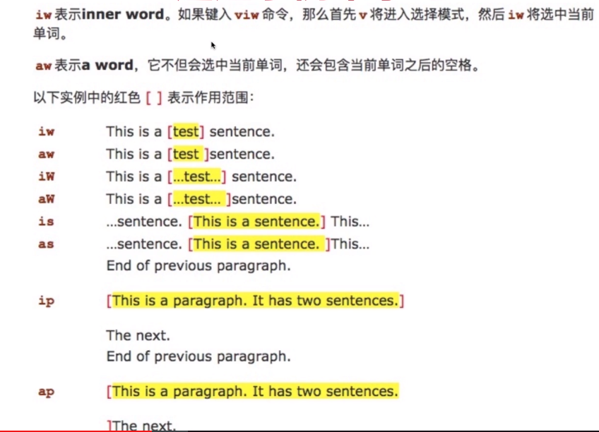
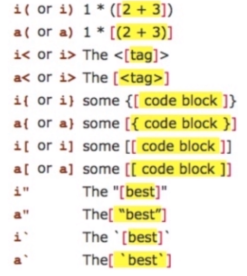

#### 进入普通模式：

- VS Code Vim修改键盘映射 Setting->Normal Mode Key Bindings ,添加：

```json
   "vim.insertModeKeyBindings": [
 {
    "before": ["j", "j"],
	"after": ["<Esc>"]
 }
],
```

- 实现按两次 j 键进入普通模式。

  <!-- more-->

#### 插入模式：

- i  -insert

- I - insert before line

- a - append 

- A - append after line

- o - open a line below

- O - open a line above

- u - undo

- 快速删除字符: 这几个快捷键也可用于Linux终端

  crtl+h 删除上一个字符 ctrl+w 删除上一个单词 ctrl+u 删除当前行
  
- 在normal模式下使用`gi`快速跳转至最后一次编辑的位置并进入插入模式

- Manjaro 里可以直接交换大写锁定与ctrl


#### 命令模式：
- :w 保存 :q 退出
  
- :vs - vertical split    :sp - split
  
- :%s/foo/bar/g 全局替换 
  
#### 可视模式:

- 快速选择文本 - hjkl选择S
- V 进入visual模式并选择行  - 执行各种命令,比如 d - 删除  y - 复制
- crtl+v 进入块状选择模式 - hjkl选择

#### Vim快速移动: Normal/Visual

- h  j(下)  k(上)  l

- 在单词间移动: w/W 移动到下一个word/WORD开头, e/E 下一个word/WORD末尾

- b/B回到上一个word/WORD开头, 可以理解为backword

  此处word指以非空白符分隔的单词, WORD是以空白符分隔的词

- **行间**搜索移动：使用`f{char}`可以移动到字符char上，使用t移动到char的前一个字符。可以使用`; ` / ` ,`继续搜该行下一个/上一个字符。`F{char}`表示反过来搜前面的字符。

- 非空白字符(可用0  w组合来替代)，**$移动到行尾**，g_移动到行尾非空白字符。

- 垂直移动：()在句子中移动，{}在段落之间移动。

- 页面移动：`gg` / `G`移动到文件开头/结尾，可用ctrl+o返回光标的上个位置。H/M/L跳转到屏幕开头Head，中间Middle，结尾Lower。crtl+u   crtl+f上下翻页upward/forward。zz把屏幕置为中间。

#### Vim快速增删改查：Normal

- 增加：a/i/o  A/I/O

- `:e!`重新加载当前文件

- 删除：`x`删除一个字符，使用`d`配合文本对象快速删除一个单词

  `daw` delete around word   删除单词及周围空格

  `diw` 删除单词但不删除周围空格

  `dd` 删除当前行

  `dt` delete to + 符号  比如`dt)`删除光标到右括号的所有内容（清空括号）

  `d$` 删除光标到行尾的内容

  `d0` 删除光标到行首的内容

  `d`和`x`可搭配数字实现多次执行，比如`4x`删除四个字符，`2dd`删除两行
  
- 修改：`r` - replace 替换一个字符，比如`ra`将当前字符改为a

   `R` - 进入Replace模式，可以连续替换，Esc退回Normal模式

   `c` - change 配合文本对象进行快速修改 （结合d的操作组合）

   `caw`   `cw`   删除单词并进入插入模式   `C`删除整行并进入插入模式   

   `ct"` 删除光标到后引号中的内容并进入插入模式

   `s` - substitute 替换并进入插入模式    `4s`删除四个字符并进入插入模式

   `S` - 删除整行并进入插入模式
   
- 查询：`/` 或 `？` 进行前向或反向搜索，`n`或`N`跳转到下一个或上一个匹配。

   `*`或者`#`进行当前光标所处单词的前向和后向匹配。
#### Vim搜索替换：

- substitute命令允许查找并替换文本，支持正则表达式。

  `:[range]s[ubstitute]/{pattern}/{string}/[flags]`

  range 10,20表示10～20行，%表示全部

  pattern 要替换的模式，string是替换后的文本

  flags 替换标志位 g - global，c - confirm

  ​      n - 报告匹配到的次数而不替换，可用来查询匹配次数

  比如`:%s/self/this/g`  `:1,6s/self/this/g`  `:1,6s/self//n`

  `:%s/\<quack\>jiao/g` 使用正则精确替换一个单词

#### 多文件操作：

- Buffer：打开的一个文件的内存缓冲区，Vim打开一个文件会加载文件到缓冲区，之后的修改都是针对内存中的缓冲区，并不会直接保存到文件，执行:w后才会把修改内容写入文件。使用`:ls`列举当前缓冲区，使用`:b`跳到第n个缓冲区。`bnext` 跳转到下一个缓冲区，`bpre` 跳转到上一个缓冲区，`:b buffer_name`使用tab补全进行跳转。

- Window：Buffer的可视化分割区域。一个缓冲区可以分成多个缓冲区，每个窗口可以打开不同缓存区。`Crtl+w w`在窗口间循环切换。`:q`  可以关闭窗口，`crtl+w =`使所有窗口等宽等高。

- Tab：组织窗口为一个工作区。Tab是可以容纳一系列窗口的容器，Vim的tab可以看成Linux虚拟桌面。`:tabe {filename}` 在新标签中打开filename  `：tabnew duck.py`打开一个编辑python文件的Tab(工作区)。

#### Text Object:

- Vim里文本也有对象的概念，比如一个单词，一段句子，一个段落。通过修改文本对象比修改单个字符高效。

- 使用文本对象：`dw`删除一个单词  `[number]<command>[text object]`

  number 次数，command - d(delete) c(change) y(yank)

  text object - w(word) s(sentence) p(paragragh)

  



#### 复制粘贴与寄存器使用：

- Vim Normal模式复制粘贴：
  - 复制粘贴分别使用y - yank和p - put，剪贴 d和p。
  - 可以使用v(visual)选择需要复制的地方，然后用p粘贴。
  - 配合文本对象：比如使用yiw复制一个单词，yy复制一行。
  
- Vim Insert模式复制粘贴：
  - 	在vimrc中设置autoindent会使Python代码缩进错乱，这时需要用`:set paste` `:set nopaste` 解决。
  - 	Insert下使用ctrl+v或cmd+v粘贴即可。
  
- Vim的寄存器：

  - Vim操作的是寄存器而不是系统剪贴板

  - 默认使用d删除或y复制的内容放到“无名寄存器”

  - 用x删除一个字符放到无名寄存器，然后p粘贴，可调换两个字符

  - 深入寄存器：Vim不使用单一剪切版进行剪切，复制与粘贴，而是多组寄存器。通过`“{register}`前缀可以指定寄存器，不指定则默认使用无名寄存器。比如使用`“ayiw`复制一个单词到寄存器a中，`“bdd`删除当前行到寄存器b中。可使用`:reg a`查看a寄存器中的内容，`“ap`粘贴a寄存器中的内容。Vim中`“”`表示无名寄存器，缺省使用，`“” p`等同于p。

  - 除了有名寄存器a-z，还有其他常见寄存器，比如复制专用寄存器`“0`使用y复制文本同时会被拷贝到复制寄存器0，在复制前加上`“+`表示复制到系统剪贴板，也可使用`:set clipboard=unnamed`直接启用系统剪贴板。还有一些寄存器比如“% 当前文件名 “. 上次插入的文本

- 以上很多内容可在VS Code Vim - setting 里进行设置而使操作便利。

#### Vim Macro：

- 给多行url链接加上双引号 - 使用宏
- 宏可以看成一系列命令的集合，可以使用宏录制一系列操作，然后再回放，从而快速把一系列命令用在多行文本上
- Normal下使用q录制/结束录制，使用`q{register}`选择要保存的寄存器，把录制的命令保存到其中，比如`qa`。
- 使用`@register`回放寄存器中保存的一系列命令
- 可在操作结尾录制下一行操作，使用`number@a`实现多行批量操作

#### 其他的话：

​		一些Vim命令本文没有提到(因为有的在VS Code Vim下不支持，而窝主要是想用这个扩展让VS Code更高效…)，其实Vim还有自定义度极高的配置文件和很多强大的插件，可以自由探索，试试NeoVim也是很不错的。

#### 图解Vim命令：


