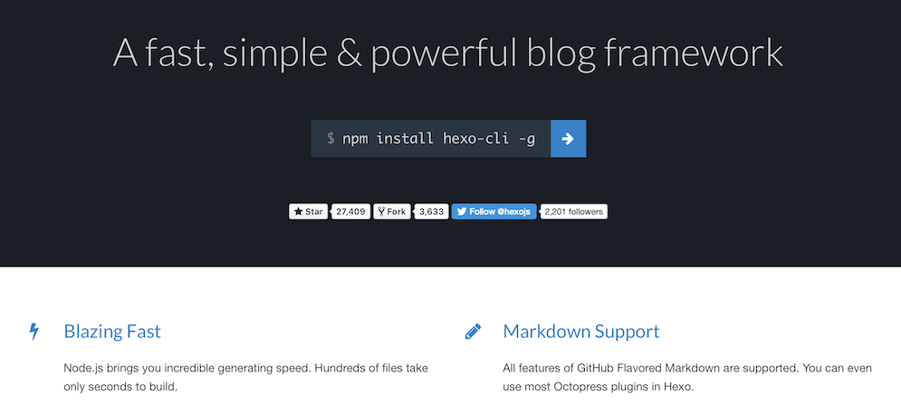

&nbsp; &nbsp; &nbsp; 因为最近发现WSL2可以基本满足对Linux的需求，再加上学校有各种各样的任务，不知不觉产生了迁回Windows10的倾向，然而，以前的博客都在Manjaro Linux上，如何节省宝贵的时间，直接在Windows上沿用先前的配置而不用重新配置呢？这就需要利用GitHub进行多端同步了。
<!--more-->
## 在 Linux 上的设置（初始端）

- 如果你使用的主题是在 github 上克隆下来的（比如 next），需要先删除主题文件夹中的`.git`和`.github`文件，以防 git 仓库嵌套及生成 GitHub-Submodule。
- 因为`hexo g -d`命令是在 master 分支上更新静态文件，也就是说，hexo 只会将`hexo generate`得到的`public`文件夹中的内容上传至 GitHub，所以，我们需要新建一个分支用来储存 Hexo 的源文件。
  ```sh
  git init
  vim .gitignore
  git add .
  git commit -m "source sync"
  git branch sync
  git checkout sync
  git remote add origin git@github.com:yourname/yourname.github.io.git
  git push origin sync
  ```
- 其中，`.gitignore`的一个示例如下：
  ```.gitignore
  .DS_Store
  Thumbs.db
  db.json
  *.log
  node_modules/
  public/
  .deploy*/
  ```
- 完成之后，GitHub 相应仓库应该已经出现了 sync 分支。

## 在 Windows 上的设置（同步端）

- 来到要进行同步的地方，在终端输入以下指令
  ```sh
  git clone -b sync git@github.com:yourname/yourname.github.io.git
  cd yourname.github.io
  npm install
  hexo new "test"
  git add .
  git commit -m "new post"
  git push origin sync
  hexo d -g
  ```

## 此时可再回到 Linux 继续更新（已在同步端更新后的初始端）

- 愉快地 Sync 吧~
  ```sh
  git pull origin sync
  hexo new "another-post"
  git add .
  git commit -m "new post"
  git push origin sync
  hexo d -g
  ```
