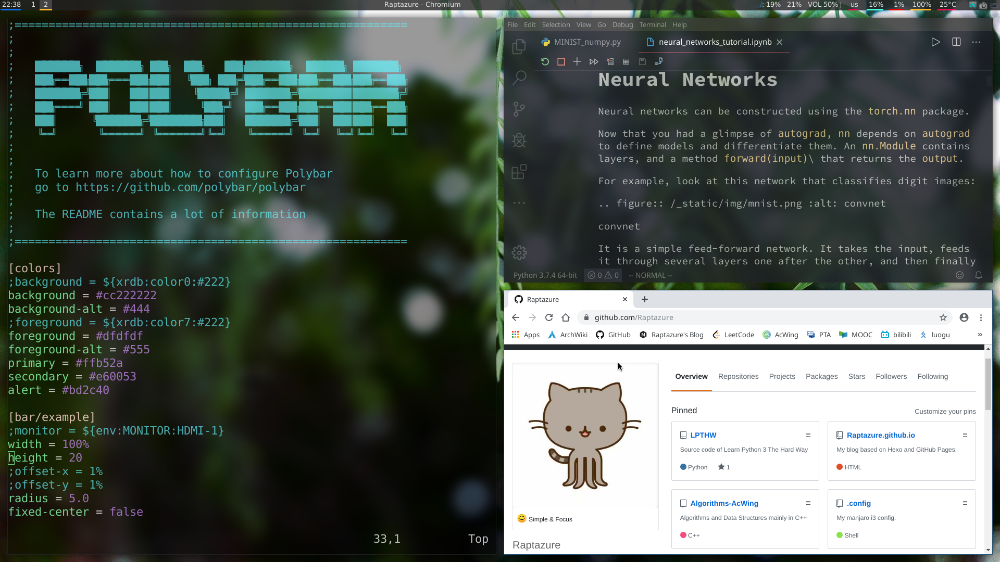

## 写在开头：
​       用manjaro KDE也有一段时间了，在感受Plasma各种便捷美观的同时，也在不断探索更轻量高效的桌面环境，直到在TheCW的视频里发现了i3wm～

面对可以变得超漂亮又可以提高效率的i3，怎么能不去尝试一下呢？

## Some Softwares：

- `fish` - A smart and user-friendly command shell for Linux.

- `oh-my-fish` - A fishshell framework that allows you to install packages which extend or modify the look and feel of your shell.

- `alacritty` - A free open-source, fast, cross-platform terminal emulator, that uses GPU (Graphics Processing Unit) for rendering. Alacritty is focused on two goals simplicity and performance.

- `ranger` - A lightweight and powerful file manager that works in a terminal window and it comes with vi/vim key bindings!

-  `albert` -  Access everything with virtually zero effort. Run applications, open files or their paths, open bookmarks in your browser, search the web, calculate things and a lot more … It is a desktop agnostic launcher and its goals are usability and beauty.

- `dmenu` - A fast and lightweight dynamic menu for X. It reads arbitrary text from stdin, and creates a menu with one item for each line. The user can then select an item, through the arrow keys or typing a part of the name, and the line is printed to stdout.

  默认i3设置里应该是`bindsym $mod+d exec dmenu_run`

- `variety` -  A wallpaper manager for Linux systems. It supports numerous desktops and wallpaper sources, including local files and online services: Flickr, Wallhaven, Unsplash, and more.

- `polybar` - A fast and easy-to-use tool for creating status bars. Polybar aims to help users build beautiful and highly customizable status bars.

- `compton` - A compositor for X. 

  可以配合alacritty实现终端模拟器的半透明化，也可以使用这个版本 (https://github.com/Raptazure/compton) 并通过编写配置文件来实现所有窗口的毛玻璃效果～配置也可以通过`conpton-conf`完成。

- `neo-vim` - 打造属于你的超级文本编辑器～

  完成后的大致效果：
  
  
  
  

## 一些常用软件的说明：

- TIM - `pacman -S deepin.com.qq.office`

  ​           安装`gnome-settings-daemon` 

  ​           后台运行 `nohup /usr/lib/gsd-xsettings > /dev/null 2>&1 &`

  ​           切换到对应目录 `cd /opt/deepinwine/apps/Deepin-TIM` 

  ​           运行 `./run.sh`

- 似乎只有wine qq稍微需要调整启动方式，其他软件比如网易云音乐，rime输入法等都可以直接使用～

- 因为我是在Manjaro KDE基础上安装的i3，原有系统软件也可以很方便地用起来，比如可以通过`albert`打开`KDE System Settings`进行一些系统配置，也可以很方便地打开dolphin～(虽然已经有ranger了…)

- 大概就是这样～以前怎么用现在照样就行～

## 关于配置文件：

- 上面提到的软件GitHub都可以找到官方文档，具体可以自己慢慢看～

- 我的配置文件：https://github.com/Raptazure/.config

## 结束的话：

   manjaro+i3 真的把简约高效美观炫酷做到了很好的平衡，总之超爱啦～希望更多的人可以用上并喜欢上Manjaro Linux + i3吧～

