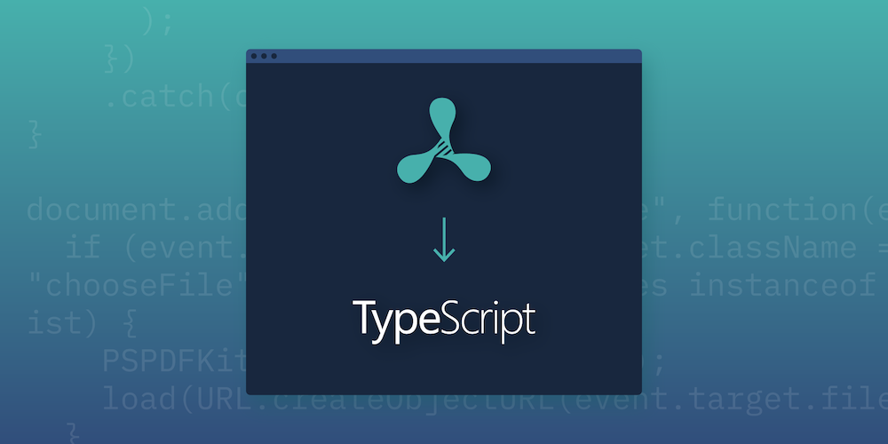

$\quad$在 Vanilla JS 里是否可以实现类似TypeScript的类型检查呢？在TS2.3版本以后，微软增加了对JS文件的TS支持，从此以后，在你的`.js`里加上几行注释就可以愉快地体验啦~

<!--more-->

### 类型检查

- 在要进行类型检查的`.js`文件的开始加上注释：`// @ts-check`，如果你正在使用 VSCode 并且代码中有不当之处的话，就可以即时看到红线以及报错信息了。
- 比如我们输入以下代码，可以发现`readonly: false`被标出了。
  ```js
  // @ts-check

  Object.defineProperty(window, "Hello, TS",
   { value: "v1.0.0", readonly: false});
  ```
- 此时通过对`defineProperty`进行`Ctrl+Click`，我们可以打开`lib.es5.d.ts`，找到下列代码，可以发现并不应该用`readonly`。
  ```ts
  interface PropertyDescriptor {
    configurable?: boolean;
    enumerable?: boolean;
    value?: any;
    writable?: boolean;
    get?(): any;
    set?(v: any): void;
  }
  ```
- 所以，我们可以这样更改代码，可以发现错误马上消失了。
  ```js
  Object.defineProperty(window, "Hello, TS",
   { value: "v1.0.0", writable: true});
  ```
- 再如以下代码：
  ```js
  function shipWeight() {
    return parseInt(document.getElementById('weight').textContent);
  }

  if (shipWeight > 100) {
    console.log('Oversize package');
  }
  ```
- 这样，ts可以帮助我们在runtime之前找出错误，而不至于发生条件一直是false但是不会报错的情况。
  ```js
  // @ts-check

  function shipWeight() {
    return parseInt(document.getElementById('weight').textContent);
  }

  if (shipWeight() > 100) {
    console.log('Oversize package');
  }
  ```
  
### 定义类型
- 除了进行类型检查之外，我们还可以通过JSDoc注释对默认类型为any的变量进行定义，比如：
  ```js
  // @ts-check

  /**
   * 
   * @param { string | string[] } emailAddr
   */
  function sendUpdates(emailAddr) {
    function sendEmail(addr) {
      if (shipWeight() > 100) {
        console.log('Oversize package');
      }
    }

    if (Array.isArray(emailAddr)) {
      emailAddr.forEach(function (val, idx) {
        sendEmail(val.trim());
      });
    } else {
      sendEmail(emailAddr.trim());
    }
  }
  ```
### 更进一步

- 如果直接把现存的JS文件扩展名修改为`.ts`的话，就需要修改相对比较多的地方了，这里仅仅列出一些Tips，具体还需要参考&nbsp;[TypeScript官方文档](https://www.typescriptlang.org/)&nbsp;以及其他资源。
- Tip1：如果使用了commonjs语句`const request = require('request');`进行import，可以使用replace+正则表达式`(?:const|let|var)\s+(\w+)\s=\srequire\((.+?)\)`和`import * as $1 from $2`完成到的es6相应语法的替换。当然，可能还要处理更多关于import和export的问题。
- Tip2：擅长利用dts文件（如果存在），受益于已经定义好的类型。
- Tip3: 加入类型不止可以帮助我们找出错误，还将有更好的自动补全提示，全面提高开发效率。同时也使代码更易于阅读与维护。