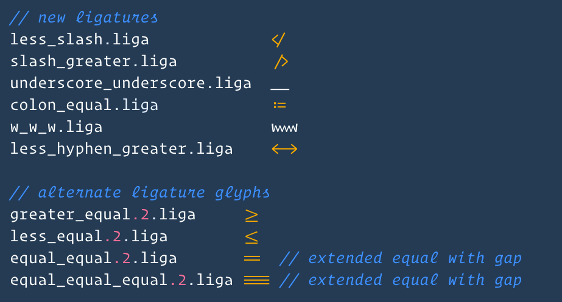

  
$\quad$漂亮的编辑器可以让写代码的心情也变好呢，对于每天都见面的VSCode，当然要看起来尽可能漂亮啦，本文就介绍一下自己目前使用的方案吧~

<!-- more -->

### 半透明背景
- 如果你正在使用Windows系统，那么推荐`Glasslt-VSC`扩展，安装之后可以自由调节透明度
- 如果正在用Linux系统，可以尝试`Glasslt Linux`，要注意看扩展的README文件哦
- 如果想要加入毛玻璃效果，可以尝试一下我在Manjaro Linux i3桌面下的方案，使用改动版的&nbsp;[compton](https://github.com/raptazure/compton)&nbsp;并添加VSCode相关的配置文件，GUI配置可以通过&nbsp;[compton-conf](https://github.com/lxqt/compton-conf)&nbsp;来实现，具体毛玻璃效果的配置方法请参考官方文档。顺便一提，理论上有了这个方法就可以毛玻璃化所有的窗口哦

### 优美的字体
- 第一个要推荐的是&nbsp;[Fira Code](https://github.com/tonsky/FiraCode)&nbsp;，支持连字，配置也很容易，在releases页面下载安装后修改`settings.json`即可，注意设置`"editor.fontLigatures": true`哦
- 第二个推荐的字体是&nbsp;[Operator Mono Lig](https://github.com/kiliman/operator-mono-lig)&nbsp;，斜体字灰常飘逸优雅，不过安装相对有点麻烦：
  - 首先要下载原版的`Operator Mono`字体，系统中需要有`Python 2.7+`，`Node.js`并使用`pip`安装了`fonttools`
  - 之后克隆Git仓库到本地，按照README的格式要求命名原版字体的otf文件，移动到`original`文件夹
  - 运行`npm install`并执行`build`操作，输出字体会出现在`build`文件夹里
  - 配置`settings.json`，比如：
  ```json
  "editor.fontFamily": "Operator Mono Lig",
  "editor.fontLigatures": true,
  "editor.fontWeight": "500",
  ```

### 和谐的主题
- 为了更好地适配`Operator Mono Lig`的斜体特性，推荐下面三个主题：
  - `Horizon Italic`：来自`Horizon Theme`，相应的Light Theme也很漂亮
  - `Community Material Theme Palenight`：来自`Material Theme`
  - `Palenight Operator`：来自`Palenight Theme`
- 不考虑适配斜体字的问题，还推荐`One Dark Pro`，不过这个应该已经很出名了哈哈

### 神奇的扩展
- 想要更具艺术性的结合？不妨来看看`Daily Tarot`扩展吧，传送门：[点我](https://marketplace.visualstudio.com/items?itemName=raptazure.daily-tarot)
- 啊咧，不小心打了个广告...基本上个人的美化方案就是这些了，欢迎讨论交流哦~