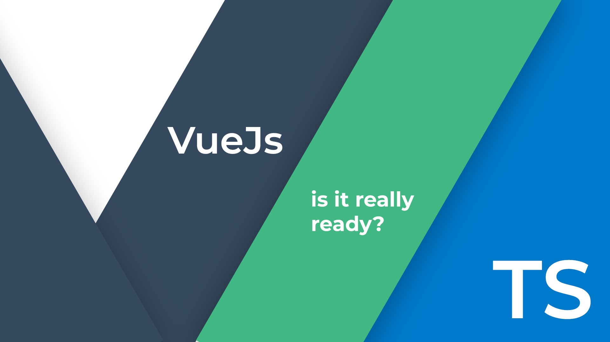

&nbsp; &nbsp; &nbsp; 虽然`vue2.x`对 TypeScript 的支持还不是非常完善，但是从今年即将到来的 3.0 版本在 GitHub 上的仓库&nbsp;[vue-next](https://github.com/vuejs/vue-next)&nbsp;看，为 TS 提供更好的官方支持应该也会是一个重要特性，那么，在迎接 3.0 之前，不妨先来看看目前版本二者的搭配食用方法吧~

<!--more-->

### 创建项目

- 虽然 GitHub 上有各种各样相关的 Starter，但是使用`Vue CLI`应该是目前相对比较好的方式，在使用`vue create`创建新项目时，对`preset`选择`Manually select features`选项，之后添加`TypeScript`
- 如果想在 vue 应用中完整使用 ES6 中提供的类特性，那么在`class-style component syntax`处选择 Y（本文主要介绍选择 Y 的情况）
- 对于`Babel`来说，一般情况选择使用，而`linter / formatter`的具体选择可根据项目需求，此处不多说明

### 进入项目

- 创建完成后，看一看`package.json`，可以发现`vue-class-component`和`vue-property-decorator`以及其他 ts 相关的 modules 都已被添加，其中：

  - `vue-class-component`可以让你使用 class-style 语法创建组件，比如以下代码：

  ```html
  <template>
    <div>
      <button @click="decrement">-</button>
      {{ count }}
      <button @click="increment">+</button>
    </div>
  </template>

  <script lang="ts">
    import Vue from "vue";
    import Component from "vue-class-component";

    // Define the component in class-style
    @Component
    export default class Counter extends Vue {
      // Class properties will be component data
      count = 0;

      // Methods will be component methods
      increment() {
        this.count++;
      }

      decrement() {
        this.count--;
      }
    }
  </script>
  ```

  - 而`vue-property-component`则完全依赖于前者，提供了除`@Component`外的其他几种装饰器，比如`@Prop`

  ```ts
  import { Vue, Component, Prop } from "vue-property-decorator";

  @Component
  export default class YourComponent extends Vue {
    @Prop(Number) readonly propA: number | undefined;
    @Prop({ default: "default value" }) readonly propB!: string;
    @Prop([String, Boolean]) readonly propC: string | boolean | undefined;
  }
  ```

  - 再来一个二者结合的简单例子吧:

  ```html
  <template>
    <div class="hello">
      <h1>{{ msg }}</h1>
      <h1>{{ fullName }}</h1>
      <button @click="reverseStr()">Reverse</button>
    </div>
  </template>

  <script lang="ts">
    import { Component, Prop, Vue, Watch } from "vue-property-decorator";

    @Component
    export default class HelloWorld extends Vue {
      @Prop() private msg!: string;
      firstName = "rapt";
      lastName = "azure";

      mounted() {
        console.log("mounted");
      }

      // Computed property
      get fullName(): string {
        return this.firstName + this.lastName;
      }

      // Method
      reverseStr() {
        this.firstName = this.firstName.split("").reverse().join("");
        this.lastName = this.lastName.split("").reverse().join("");
      }
    }
  </script>
  ```

- 此时，你的 vue 项目已经有 fully-typed 的可能了，当然也会有更好的自动补全以及错误提示。
- 为了更好的确定类型，可以创建例如`interfaces`这样的文件夹，充分利用 ts 的接口和类来使项目有更好的组织结构，可读性和维护性。

### 另一种选择

- 其实当然也可以不使用 class 风格啦，这样的话，就和平时熟悉的 vue 更为相似了，而对类型当然也是完全支持的。
- 这里也提供一个简单的例子吧~

  ```html
  <template>
    <div class="hello">
      <h1>{{ msg }}</h1>
      <h1>{{ test }}</h1>
    </div>
  </template>

  <script lang="ts">
    import Vue from "vue";

    export default Vue.extend({
      name: "HelloWorld",
      props: {
        msg: String,
      },
      data() {
        return {
          test: "Hello from TS" as string,
        };
      },
      methods: {
        pressMe(): string {
          return this.test + "br";
        },
      },
    });
  </script>
  ```

### 其他的话

- 本文只是简要探讨了在 Vue.js 中使用 TypeScript 的可能性，更多的相关内容在&nbsp;[官方文档](https://vuejs.org/v2/guide/typescript.html)&nbsp;里可以找到哦，或者也可以多去 Github 的 Vue 区，TS 区逛逛呢~
- TypeScript 的出现为 JavaScript 的生态带来了新活力，不管是前端三大框架 Vue，React，Angular，还是 Node 系的后端框架比如 Nest 和 Express，都在积极拥抱 TS，希望以后整个生态会发展得越来越好吧~
